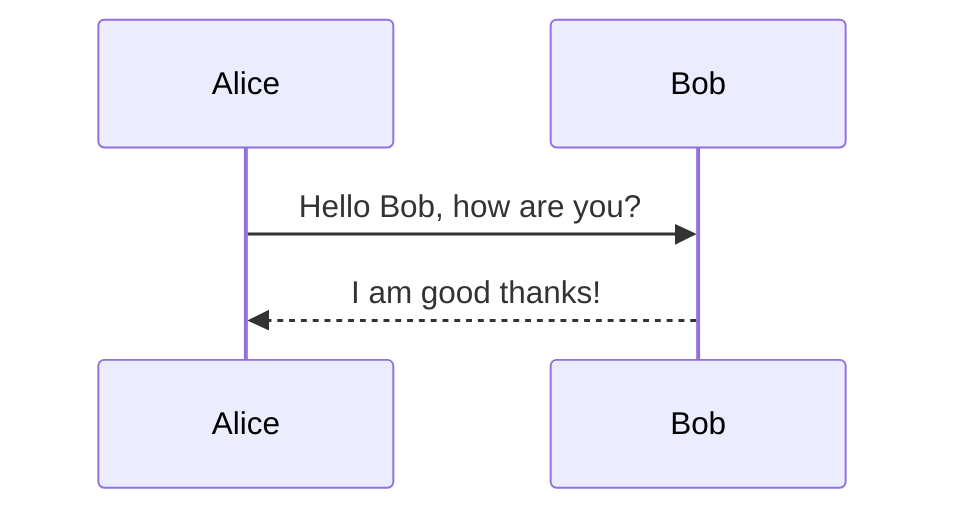

This document demonstrates various elements of Markdown formatting and typography that can be used in your content.

## Heading 2

### Heading 3

#### Heading 4

##### Heading 5

###### Heading 6

## Text Formatting

**Bold text** using double asterisks

**Bold text** using double asterisks (alternative)

*Italic text* using single asterisks

*Italic text* using single asterisks (alternative)

***Bold and italic text*** using triple asterisks

~~Strikethrough text~~ using double tildes

`Inline code` using backticks

Highlighted/marked text using custom styles

Superscript: X² using Unicode

Subscript: H₂O using Unicode

## Horizontal Rules

Three hyphens:

---

## Blockquotes

> Single line blockquote

> Multiline blockquote
>
> With multiple paragraphs

> Nested blockquotes can also be created
>> By using additional angle brackets

## Lists

### Unordered Lists

- Item 1
- Item 2
  - Nested item 2.1
  - Nested item 2.2
- Item 3

### Ordered Lists

1. First item
2. Second item
   1. Nested item 2.1
   2. Nested item 2.2
3. Third item

### Task Lists

- [x] Completed task
- [ ] Incomplete task
- [ ] Another task
  - [x] Nested completed task
  - [ ] Nested incomplete task

## Code Blocks

Inline code: `const example = "hello world";`

```text
// Code block with plain text syntax highlighting
function sayHello() {
  console.log("Hello, world!");
}
```

```javascript
// JavaScript code block with syntax highlighting
function sayHello() {
  console.log('Hello, world!')
}
```

```python
# Python code block with syntax highlighting
def say_hello():
    print("Hello, world!")
```

```css
/* CSS code block with syntax highlighting */
body {
  font-family: 'Helvetica', sans-serif;
  color: #333;
}
```

## Links

[Basic link](https://www.example.com)

[Link with title](https://www.example.com "Example Website")

[Reference link][reference-id]

[reference-id]: https://www.example.com "Example Website"

Autolinked URLs: <https://www.example.com>

<https://www.example.com> (using angle brackets)

Email link: <example@example.com>

## Images


[](https://www.example.com)

## Tables

| Header 1 | Header 2 | Header 3 |
|----------|----------|----------|
| Cell 1   | Cell 2   | Cell 3   |
| Cell 4   | Cell 5   | Cell 6   |

Aligned tables:

| Left-aligned | Center-aligned | Right-aligned |
|:-------------|:--------------:|---------------:|
| Left         | Center         | Right          |
| Aligned      | Aligned        | Aligned        |

## Footnotes

Here's a sentence with a footnote reference. [^1]

[^1]: This is the footnote content.

## Definition Lists

Term 1
: Definition 1

Term 2
: Definition 2a
: Definition 2b

## Abbreviations

*[HTML]: Hyper Text Markup Language
*[CSS]: Cascading Style Sheets

The HTML and CSS abbreviations will show the full meaning when hovered over.

## Emoji

Some basic emoji examples: 😄 🎉 👍 🐱 🚀

## Math (LaTeX)

Inline math: $E = mc^2$

Block math:

$$
\frac{d}{dx}(x^n) = nx^{n-1}
$$

## Diagrams (Mermaid)




## Special Characters

Copyright: &copy;
Registered trademark: &reg;
Trademark: &trade;
Euro: &euro;
Left arrow: &larr;
Up arrow: &uarr;
Right arrow: &rarr;
Down arrow: &darr;

## Escaping Characters

\*This text is surrounded by asterisks but not italic\*

\# This is not a heading

\- This is not a list item
